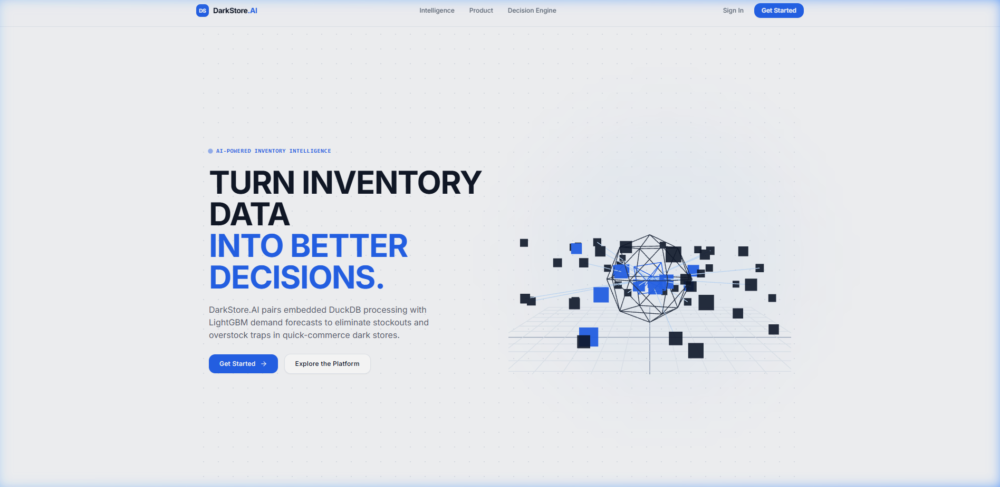
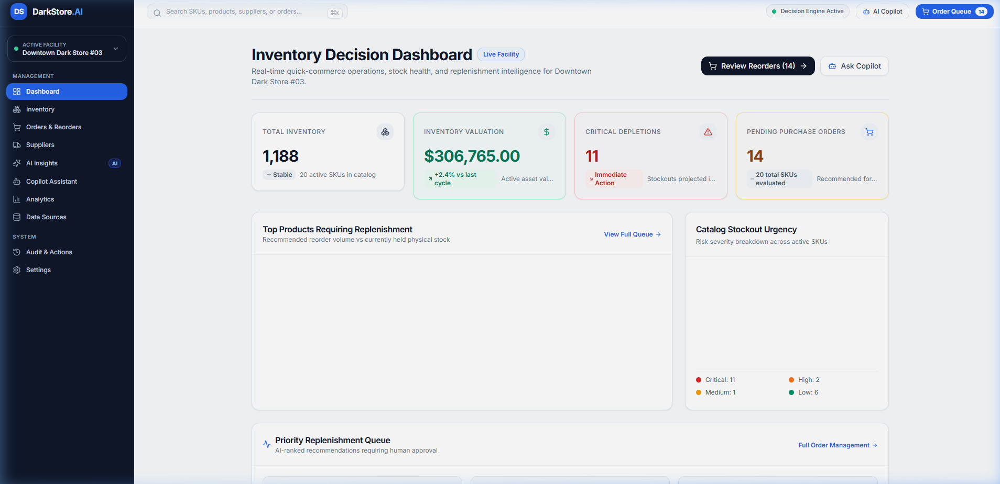
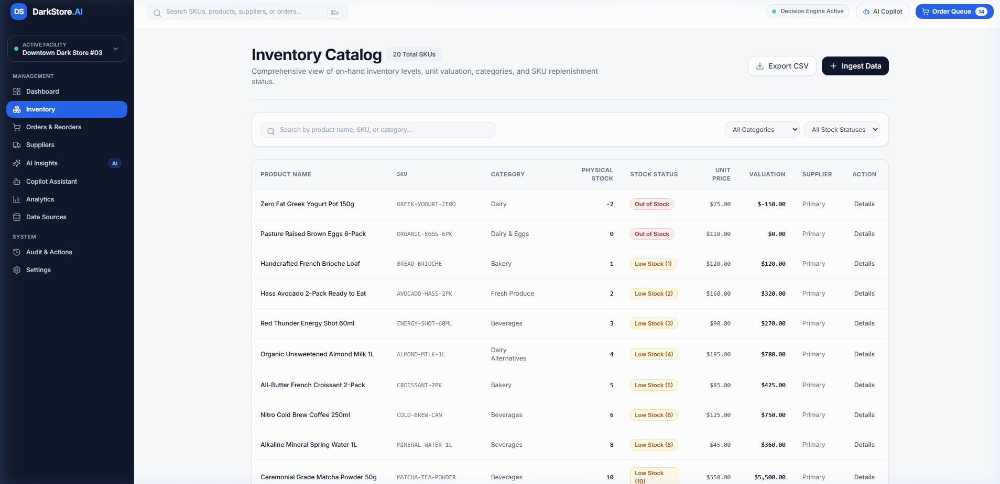
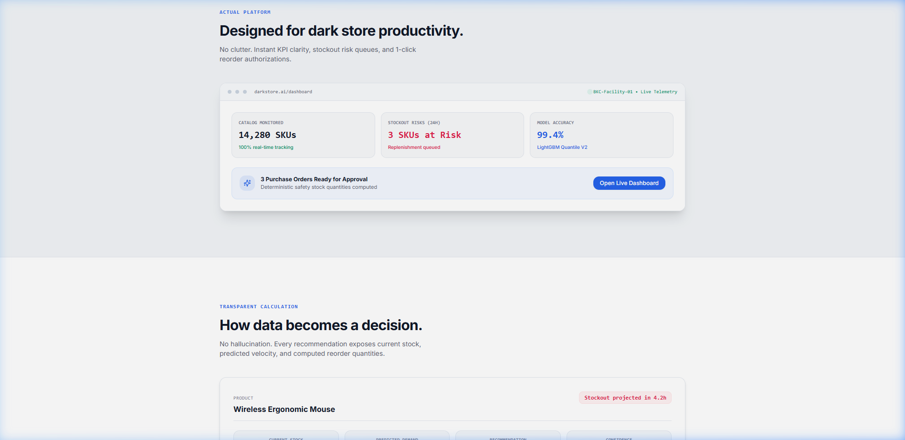
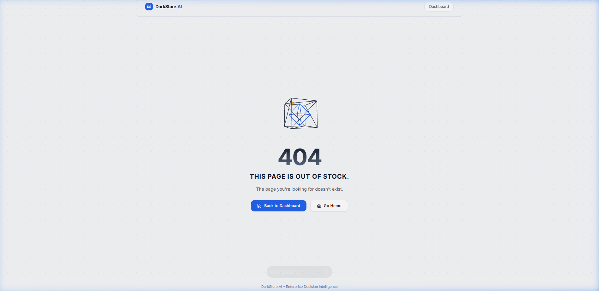
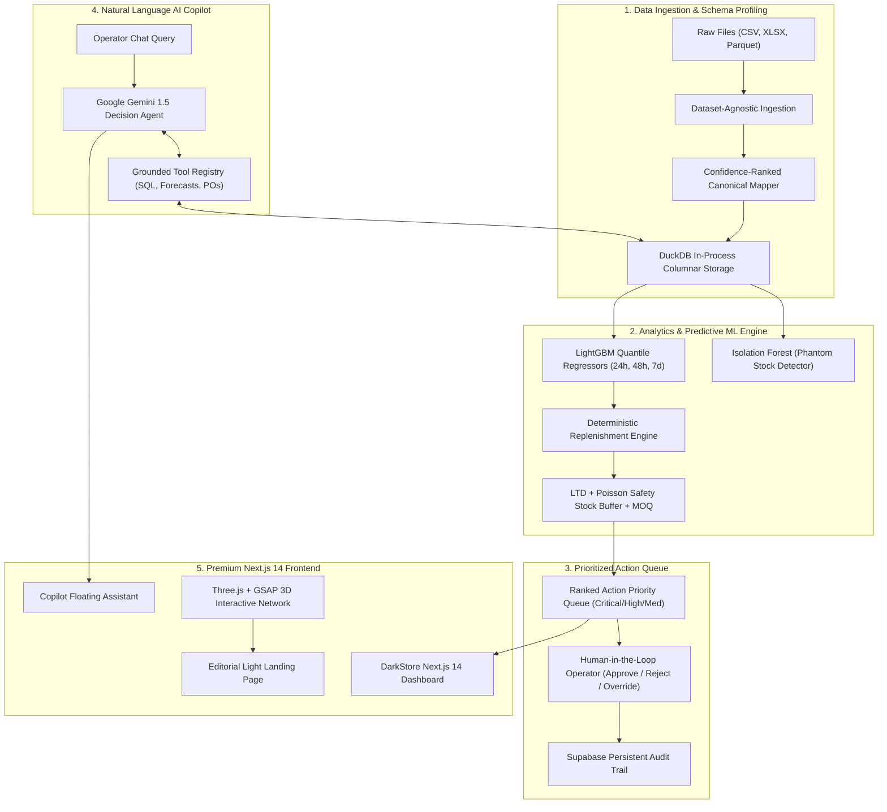

# DarkStore.AI — Autonomous AI Inventory Decision Engine

<div align="center">



**Next-generation inventory intelligence and deterministic replenishment layer built for quick-commerce dark stores, micro-fulfillment centers, and retail warehouses.**

[-black?style=for-the-badge&logo=next.js)](https://nextjs.org/)
[](https://fastapi.tiangolo.com/)
[](https://duckdb.org/)
[](https://lightgbm.readthedocs.io/)
[](https://threejs.org/)
[](https://ai.google.dev/)
[](https://www.typescriptlang.org/)
[](https://www.python.org/)

</div>

---

## 📖 Table of Contents

- [Overview & Problem Statement](#-overview--problem-statement)
- [Visual Showcase](#-visual-showcase)
- [System Architecture & Workflow](#-system-architecture--workflow)
- [AI Agent Architecture (LangChain, LangGraph & Tools)](#-ai-agent-architecture-langchain-langgraph--tool-augmented-reasoning)
- [Key Features](#-key-features)
- [Technology Stack](#-technology-stack)
- [Project Directory Structure](#-project-directory-structure)
- [Installation & Setup](#-installation--setup)
- [API Reference](#-api-reference)
- [Roadmap & Development Status](#-roadmap--development-status)
- [License](#-license)

---

## 🚀 Overview & Problem Statement

Quick-commerce dark stores operate under extreme operational pressures:
- **Sub-15 Minute Deliveries**: Zero buffer time to recover from a stockout during demand spikes.
- **Volatile Hourly Velocity**: Spikes driven by localized weather, festivals, meal times, and hyper-local events.
- **Phantom Inventory**: Shelf shrinkage and barcode scanning miscounts leading ERP systems to believe inventory exists when shelves are empty.
- **The Capital Trap**: Overstocking ties up valuable working capital and triggers shelf expiry; understocking forfeits high-margin instant-delivery orders.

**DarkStore.AI** bridges this gap by unifying **in-process columnar analytics (DuckDB)**, **multi-horizon quantile machine learning (LightGBM)**, and **grounded natural-language reasoning (Google Gemini)** into a single, cohesive decision engine. It transforms raw warehouse events into automated, deterministic purchase orders with human-in-the-loop audit oversight.

---

## 🖼️ Visual Showcase

### 1. Editorial Light-Theme Landing Page
*Spacious editorial typography (`#F7F8FA` warm neutral background) combined with a high-contrast Three.js interactive 3D procedural data network.*


---

### 2. Live Operational Dashboard
*Real-time SKU monitoring, 24h stockout risk alarms, model confidence indices, and one-click purchase order authorization queues.*



---

### 3. Catalog & Inventory Intelligence
*Real-time stock velocity, safety stock calculation, supplier MOQ constraints, and item depletion alerts.*



---

### 4. Transparent AI Decision Engine & Platform Preview
*No hallucinated recommendations. Every action exposes current stock, LightGBM predicted demand, and the exact deterministic replenishment equation.*



---

### 5. Technical 404 Recovery Experience
*Matching light-theme 404 state featuring procedural coordinate box geometry and searching node indicator.*



---

## 🏗️ System Architecture & Workflow



### End-to-End Workflow:
1. **Telemetry & Ingestion**: POS transactions, barcode rider pick scans, and supplier receipts are ingested without requiring cloud data warehouse roundtrips.
2. **Canonical Mapping**: Automated semantic field detection maps diverse vendor spreadsheets to standard fields (`sku_id`, `current_stock`, `hourly_sales`, `lead_time_days`, `reorder_cost`).
3. **Anomaly Isolation**: Isolation Forest models spot zero-sales discrepancies on high-stock items, isolating phantom inventory.
4. **Quantile Demand Forecasting**: LightGBM quantile regression models demand intervals ($P_{10}, P_{50}, P_{90}$) to safeguard against unpredictable demand spikes.
5. **Deterministic Replenishment**:
   $$\text{PO Quantity} = \max\left(0, \text{TargetDemand}_{\text{LTD}} - \text{Stock}_{\text{OnHand}} + \text{SafetyStock}_{\text{Poisson}}\right)$$
   Respecting minimum order quantities (MOQ) and batch case sizes.
6. **Copilot Grounding**: Operators query inventory status through Google Gemini; the model executes tool calls directly against DuckDB tables with 0% numerical hallucination.

---

## 🤖 AI Agent Architecture (LangChain, LangGraph & Tool-Augmented Reasoning)

DarkStore.AI integrates a multi-agent analytical workflow designed for high-throughput quick-commerce decisioning. The agent ecosystem is built with **LangChain**, **LangGraph**, and **Google Gemini 1.5**, structured around deterministic tool execution:

```
                      ┌──────────────────────────────────────────────┐
                      │    Operator Natural Language Query           │
                      │  "What should I order today?" / "Coke stock" │
                      └──────────────────────┬───────────────────────┘
                                             │
                                             ▼
                      ┌──────────────────────────────────────────────┐
                      │          Supervisor Agent / Router           │
                      │  (Intent Classification & Tool Selection)    │
                      └──────────────────────┬───────────────────────┘
                                             │
       ┌────────────────────────┬────────────┴────────────┬────────────────────────┐
       ▼                        ▼                         ▼                        ▼
┌──────────────┐       ┌─────────────────┐       ┌─────────────────┐      ┌─────────────────┐
│ search_      │       │ get_inventory_  │       │ get_replenish_  │      │ get_stockout_   │
│ product()    │       │ summary()       │       │ recommendations │      │ risk()          │
└──────┬───────┘       └────────┬────────┘       └────────┬────────┘      └────────┬────────┘
       │                        │                         │                        │
       └────────────────────────┼─────────────────────────┴────────────────────────┘
                                │
                                ▼
                      ┌──────────────────────────────────────────────┐
                      │      Deterministic OLAP Execution            │
                      │  (DuckDB + PyArrow Columnar Repositories)    │
                      └──────────────────────┬───────────────────────┘
                                             │ [Verified Numerical Payload]
                                             ▼
                      ┌──────────────────────────────────────────────┐
                      │   Google Gemini 1.5 Synthesis & Reasoning    │
                      │   (Strict Zero-Hallucination System Prompt)  │
                      └──────────────────────┬───────────────────────┘
                                             │
                                             ▼
                      ┌──────────────────────────────────────────────┐
                      │  Actionable Answer + 1-Click PO Dispatch     │
                      └──────────────────────────────────────────────┘
```

### 1. Modular Tool Registry (`backend/app/agents/tools.py`)
The agent interacts with the dark-store environment exclusively through 9 deterministic Python analytical tools:
- `search_product_tool`: Fuzzy and exact SKU/product name search over catalog memory.
- `get_inventory_summary_tool`: Macro overview (out-of-stock counts, low stock counts, catalog health).
- `get_inventory_tool`: Granular on-hand and available unit quantities for individual or all SKUs.
- `get_replenishment_recommendations_tool`: Math-verified PO quantities factoring in lead time and MOQ.
- `get_stockout_risk_tool`: Estimated hours until stock depletion based on LightGBM velocity.
- `get_anomalies_tool`: Phantom inventory discrepancies flagged by Isolation Forest models.
- `get_product_details_tool`: Deep-dive SKU telemetry, supplier terms, and reorder economics.
- `get_action_queue_tool`: Urgency-ranked operational actions queue (Critical, High, Medium, Low).
- `get_data_quality_tool`: Ingestion mapping confidence scores and missing feature diagnostics.

### 2. Zero-Hallucination Design Pattern
Quick-commerce operators cannot afford generative hallucinations on purchasing decisions. DarkStore.AI enforces a strict separation of concerns:
- **Calculation Layer (Deterministic)**: DuckDB, LightGBM, and mathematical Poisson algorithms perform all aggregations, forecasts, and reorder math.
- **Reasoning Layer (LLM)**: Gemini consumes the structured tool outputs and translates them into concise, natural-language executive briefs with action links.

### 3. LangGraph & LangChain Multi-Agent Compatibility
- **LangChain / LangGraph Dependencies**: Configured in `backend/requirements.txt` (`langchain>=0.1.13`, `langgraph>=0.0.30`, `langchain-google-genai>=1.0.1`) and `environment.yml`.
- **StateGraph Ready**: The tool registry is decoupled from the LLM harness, allowing seamless binding into LangGraph `StateGraph` workflows with conditional edges, human-in-the-loop review nodes, and session persistence.
- **Low-Latency Runtime**: The default production service (`GeminiCopilotService`) executes direct tool dispatch to achieve sub-500ms responses for time-sensitive dark-store managers.

---

## ✨ Key Features

- **Universal Schema Parser**: Ingest arbitrary CSV, Excel, or Parquet datasets without requiring predefined column schemas.
- **In-Memory Analytical Engine**: DuckDB with zero-copy PyArrow integration delivers sub-50ms queries over tens of thousands of SKUs.
- **LightGBM Multi-Horizon Forecasting**: 24h, 48h, and 7-day probabilistic forecasts adapted for fast-moving consumer goods (FMCG).
- **Phantom Inventory Detection**: Unsupervised Isolation Forest flags ghost items before stockouts harm customer fulfillment.
- **Deterministic Action Prioritization**: Urgency-ranked replenishment alerts categorized by business impact ($) and stockout velocity.
- **Tool-Augmented AI Copilot**: Google Gemini reasoning over real-time analytical SQL tools without hallucinating figures.
- **Human-in-the-Loop Auditing**: Operator approvals, quantity overrides, and rejections are logged immutably.
- **Editorial Light-Theme Design**: Warm neutral palette (`#F7F8FA`), deep charcoal typography (`#111827`), DarkStore blue accents (`#2563eb`), and custom Three.js WebGL data networks.

---

## 🛠️ Technology Stack

| Domain | Technology | Purpose |
|---|---|---|
| **Frontend Framework** | **Next.js 14** (App Router) | Server-side rendering, client routing, API routes |
| **Language & Typing** | **TypeScript 5** | Strict end-to-end type safety |
| **Styling & UI** | **Tailwind CSS + Lucide Icons** | Custom design system, responsive layouts |
| **3D & Animation** | **Three.js + GSAP** | High-performance WebGL data network, scroll parallax |
| **Backend Framework** | **FastAPI** | High-throughput async REST endpoints |
| **Analytical Engine** | **DuckDB + PyArrow** | Embedded OLAP columnar analytical database |
| **Data Processing** | **Pandas + NumPy + SciPy** | Scientific computation and Poisson distribution |
| **Machine Learning** | **LightGBM + Scikit-learn** | Quantile gradient boosting and Isolation Forest |
| **AI Agent Orchestration** | **LangChain + LangGraph** | Multi-agent state graphs, tool bindings, and workflows |
| **Large Language Model** | **Google Gemini 1.5** | Natural language reasoning over real-time tools |
| **Database & Auth** | **Supabase (PostgreSQL)** | RLS security policies, relational persistence, auth |
| **Environment Management** | **Conda / Python 3.10** | Reproducible cross-platform ML runtime |

---

## 📁 Project Directory Structure

```text
build_with_ai/
├── backend/
│   ├── app/
│   │   ├── api/              # FastAPI endpoints (inventory, forecast, actions, copilot)
│   │   ├── core/             # Configuration, logging, and security settings
│   │   ├── db/               # DuckDB connection layer and schema definitions
│   │   ├── models/           # Pydantic v2 schemas and validation contracts
│   │   ├── services/         # Business logic (replenishment, ingestion, analytics)
│   │   └── main.py           # FastAPI application entrypoint
│   └── tests/                # Backend unit and integration tests
├── frontend/
│   ├── app/
│   │   ├── (auth)/login/     # Operator authentication view
│   │   ├── 404/              # Custom 404 recovery route
│   │   ├── actions/          # Action priority queue and replenishment triggers
│   │   ├── dashboard/        # Operational overview and dark-store metrics
│   │   ├── insights/         # Anomaly detection and forecast visualizer
│   │   ├── inventory/        # SKU catalog, safety stocks, and stock status
│   │   ├── layout.tsx        # Next.js root layout with AppShell wrapper
│   │   ├── not-found.tsx     # Light-theme 404 handler
│   │   └── page.tsx          # Editorial light-theme landing page
│   ├── components/
│   │   ├── 3d/               # Three.js components (DataNetwork3D, Package404_3D)
│   │   ├── dashboard/        # KPI summary widgets, charts, and risk radars
│   │   ├── layout/           # AppShell, Sidebar, and Topbar
│   │   └── ui/               # Reusable buttons, badges, modals, and LoadingScreen
│   ├── hooks/                # Custom React hooks (useCountUp, animations)
│   ├── lib/                  # GSAP animations, Supabase client, and utils
│   └── public/               # Static assets, icons, and fonts
├── ml/                       # LightGBM training pipelines and sample models
├── data/                     # Sample FMCG dark store telemetry and mock datasets
├── docs/                     # Architecture blueprints, data contracts, and workflows
│   └── screenshots/          # Embedded UI images for documentation
├── supabase/                 # Database migrations, RLS policies, and seed scripts
├── .env.example              # Environment variables template
├── environment.yml           # Conda ML environment specification
├── docker-compose.yml        # Multi-container orchestration
└── README.md                 # Project documentation
```

---

## 💻 Installation & Setup

### Prerequisites

- **Python**: `>= 3.10`
- **Node.js**: `>= 18.17.0` (LTS recommended)
- **Conda** (Miniconda / Anaconda) or `venv`
- **Git**

---

### Step 1: Clone the Repository

```bash
git clone https://github.com/debmalyaa29/AI_Agent-Inventory-Management-system.git
cd AI_Agent-Inventory-Management-system
```

---

### Step 2: Configure Environment Variables

Create `.env` in the project root:

```bash
cp .env.example .env
```

Edit `.env` with your credentials:

```ini
# Supabase Configuration
SUPABASE_URL=https://your-project.supabase.co
SUPABASE_PUBLISHABLE_KEY=your_publishable_anon_key
SUPABASE_SECRET_KEY=your_supabase_secret_service_key

# Google Gemini AI Configuration
GEMINI_API_KEY=your_gemini_api_key
```

---

### Step 3: Backend Setup

#### Option A: Using Conda (Recommended for ML dependencies)

```bash
# Create and activate conda environment
conda env create -f environment.yml
conda activate inventory-ai

# Start backend server
cd backend
python -m uvicorn app.main:app --host 0.0.0.0 --port 8000 --reload
```

#### Option B: Using Standard Python `venv` & `pip`

```bash
python -m venv venv

# Windows
venv\Scripts\activate
# macOS/Linux
source venv/bin/activate

pip install -r backend/requirements.txt
cd backend
python -m uvicorn app.main:app --host 0.0.0.0 --port 8000 --reload
```

- **Health Check**: `http://localhost:8000/health`
- **Interactive Swagger Docs**: `http://localhost:8000/docs`

---

### Step 4: Frontend Setup

Open a second terminal window:

```bash
cd frontend

# Install Node dependencies
npm install

# Start Next.js development server
npm run dev
```

- **Landing Page**: `http://localhost:3000/`
- **Operational Dashboard**: `http://localhost:3000/dashboard`
- **Inventory Explorer**: `http://localhost:3000/inventory`
- **AI Insights**: `http://localhost:3000/insights`

---

## 📡 API Reference

| Method | Endpoint | Description |
|---|---|---|
| `GET` | `/health` | System health check and status |
| `GET` | `/api/inventory` | Retrieve inventory catalog with live stock status |
| `GET` | `/api/inventory/{sku_id}` | Retrieve detailed SKU telemetry and history |
| `POST` | `/api/upload` | Ingest arbitrary CSV/Parquet files for profiling |
| `GET` | `/api/forecast/{sku_id}` | Return 24h, 48h, 7d LightGBM quantile demand forecasts |
| `GET` | `/api/actions` | Retrieve prioritized replenishment actions queue |
| `POST` | `/api/actions/{action_id}/execute` | Authorize and dispatch purchase order |
| `POST` | `/api/copilot/chat` | Send natural language inquiry to Google Gemini Agent |

Interactive documentation is available at `http://localhost:8000/docs`.

---

## 🗺️ Roadmap & Development Status

- [x] Universal tabular dataset parsing & canonical schema detection
- [x] Embedded DuckDB analytics layer with sub-50ms execution
- [x] Multi-horizon LightGBM quantile demand forecasting (24h, 48h, 7d)
- [x] Poisson safety-stock buffer calculations with MOQ constraints
- [x] Google Gemini natural language copilot with zero-hallucination tool grounding
- [x] Human-in-the-loop action approval queue and audit history
- [x] Premium light-theme landing page with Three.js 3D WebGL network
- [ ] Direct Purchase Order (PO) automated PDF/Excel generator and supplier email dispatch
- [ ] Multi-store / multi-dark-store comparative network balancing
- [ ] Real-time WMS/ERP webhooks integration
- [ ] Automated markdown optimization for expiring perishables

---

## 📄 License

This project is licensed under the MIT License — see the [LICENSE](LICENSE) file for details.

<div align="center">
Built with precision for modern quick-commerce fulfillment.
</div>
